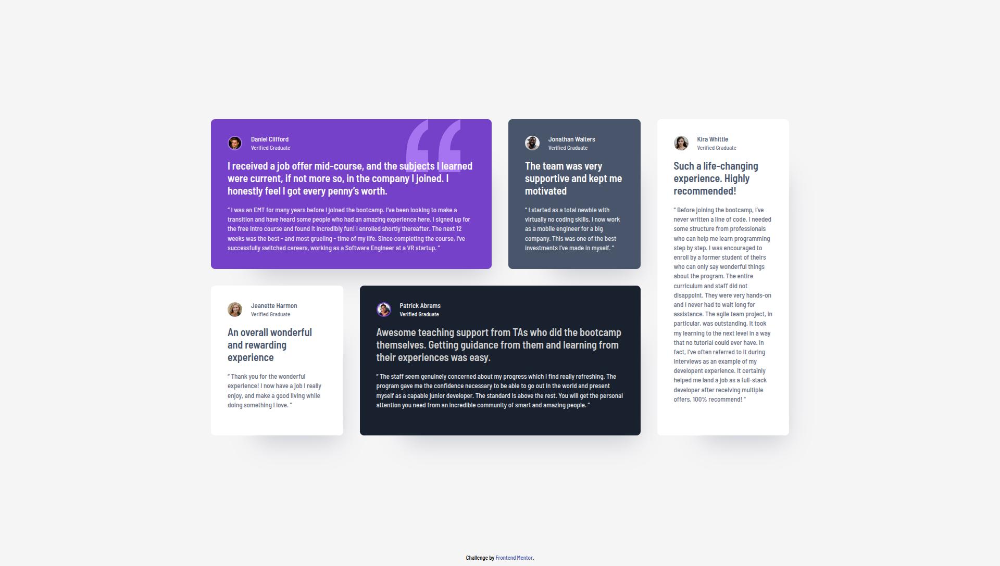

# Frontend Mentor - Testimonials grid section solution

This is a solution to the [Testimonials grid section challenge on Frontend Mentor](https://www.frontendmentor.io/challenges/testimonials-grid-section-Nnw6J7Un7). Frontend Mentor challenges help you improve your coding skills by building realistic projects.

## Overview

This project implements a responsive testimonial section featuring multiple testimonial cards arranged in a grid. It is a mobile-first implementation using CSS Grid and Flexbox.

### Screenshot

### Links

- (https://biruchenko.github.io/testimonials-grid-section-solution/)

### Built with

- Semantic HTML5
- CSS custom properties
- CSS Grid (responsive layout)
- Mobile-first workflow

## Acknowledgments

- Challenge by [Frontend Mentor](https://www.frontendmentor.io).
